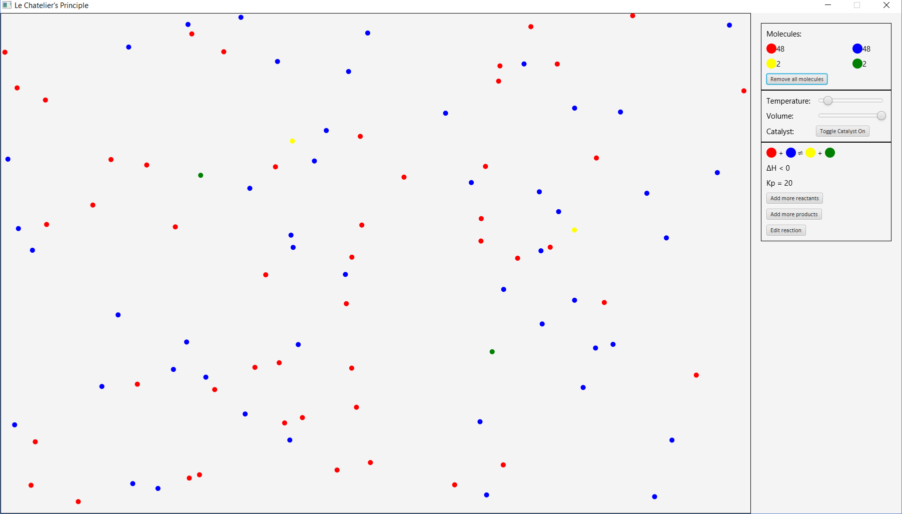

This computer simulation is meant to present the concepts of Le Chatelier’s Principle. 

The box on the left defines the area we are interested in whereby all the involved molecules will be contained. They are in constant, random motion and undergo elastic collision upon hitting another object (borders or other molecules). It is to be noted that only molecules we are interested in are being shown but in reality, there exists other molecules in the area.

The box on the right is the control panel whereby users can set their desired variables (Temperature, Volume, Catalyst) and edit the existing reaction (Products, Reactants, Enthalpy change, Kp) in order to better understand concepts. 

Essentially, the chance of effective collision occurring between reactant(s) or product(s) is based on the Kp constant of the reaction at that specific temperature. The higher the Kp value, the higher the chance of the forward reaction occurring and the lower the chance of the reverse reaction. The algorithm for this is that a random number between set values is generated when a collision happens whereby if this number is smaller than the Kp value, forward reaction will occur if colliding molecules satisfies the reactant needs, and if it is bigger than the Kp value, reverse reaction can occur.

The temperature can be varied whereby a higher temperature favours the endothermic reaction to remove the excess heat and a lower temperature favours the exothermic reaction to release more heat. This concept is coded with the help of Van’t Hoff equation showing the temperature dependence of Kp, with the ΔH value set to be high in order to make the change more obvious.

The volume can be varied which would change the pressure of the container. This will only affect reactions which do not have the same number of products and reactants. When volume is decreased, pressure is increased and the reaction producing lesser molecules is favoured to lower the pressure. Simulation wise, this happens naturally since a smaller volume means a higher chance for two molecules to collide to form one.

Catalyst can be turned on and off. Presence of catalyst does not affect the equilibrium position of the reaction but having a catalyst will ensure a higher portion of collisions are effective. Algorithm wise, this is implemented by having a non-catalyst reaction to satisfy an extra condition (Using random number generator and min value) in order to have effective collision.

Reactants and products can be added. This will favour the forward and reverse reaction respectively in order to use up the additional molecules. Simulation wise, this happens naturally since more molecules means more effective collisions. 

